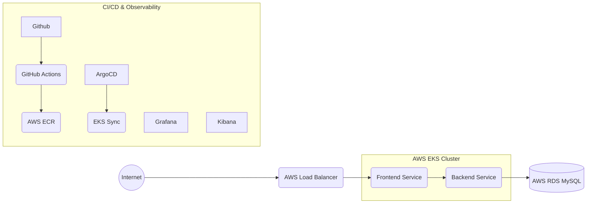
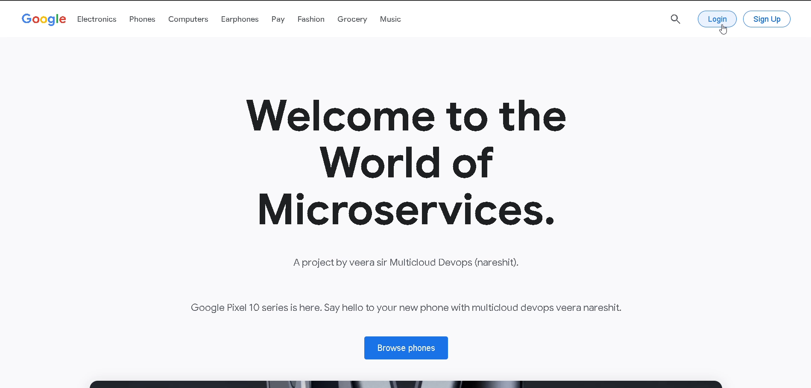
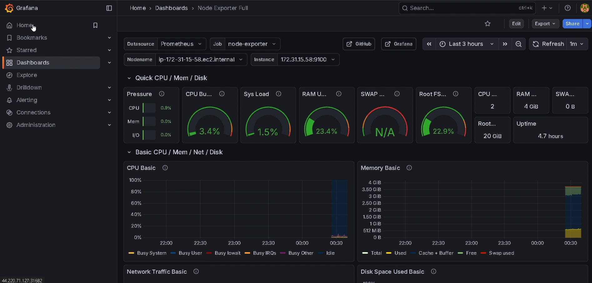
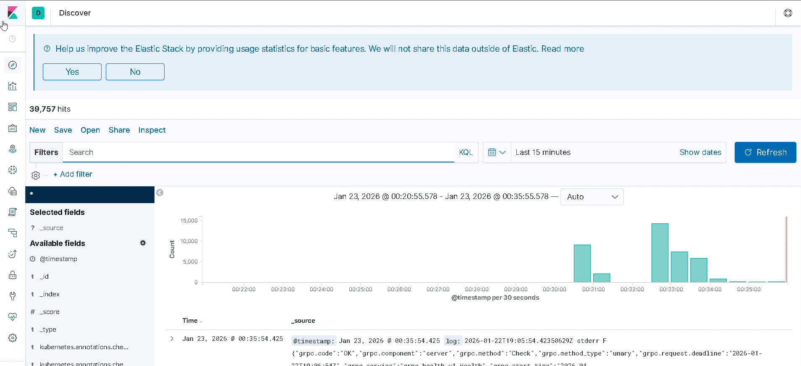

# 🛍️ Google Store Microservices on AWS


> **A scalable, cloud-native e-commerce platform replicating the Google Store experience. Deployed on AWS EKS using a complete DevSecOps pipeline with GitOps principles.**

---

## 📹 Project Demo
**Watch the live deployment and walkthrough of the project:**

[](https://drive.google.com/file/d/1k_RDfrIGPMhVNENQNejR8mn8NhDZ-_Ch/view?usp=drive_link)

*(Click the image above to watch the video)*

---

## 🏗️ Architecture

### Architecture Flow
The application follows a secure, decoupled traffic flow:

`Internet` → `AWS ALB` → `K8s Frontend Service` → `K8s Backend Service` → `AWS RDS (Private)`

### Data Flow Visualization



---

## 🛠️ Tech Stack

| Category | Technologies |
|----------|--------------|
| **Cloud Infrastructure** | AWS (EKS, EC2, ECR, RDS, IAM) |
| **Containerization** | Docker, Kubernetes (Pods, Services, Deployments) |
| **CI/CD** | GitHub Actions (CI), ArgoCD (GitOps/CD) |
| **Observability** | Grafana (Metrics), Kibana (Logs), Prometheus |
| **Database** | AWS RDS (MySQL) |
| **Frontend/Backend** | React.js / Node.js (Microservices) |

---

## 🚀 Key Features

* **Microservices Architecture:** Decoupled frontend and backend deployed as separate pods for independent scaling.
* **GitOps Deployment:** Full synchronization using ArgoCD; changes in Git reflect instantly in the cluster.
* **Automated CI Pipelines:** GitHub Actions automatically builds and pushes Docker images to ECR on every commit.
* **Resilient Data Management:** Stateful data managed via AWS RDS with private subnet isolation for security.
* **Full Observability:** Real-time system metrics monitoring with Grafana and centralized logging via Kibana.
* **High Availability:** Utilizes Kubernetes LoadBalancers and Horizontal Pod Autoscaling (HPA).

---

## ⚙️ Deployment Guide

### Prerequisites
* AWS Account with CLI configured
* `kubectl` installed
* `eksctl` (optional, for cluster creation)
* Docker Desktop

### 1. Infrastructure Setup
Provision the EKS cluster and RDS database.
```bash
# Example command to create cluster
eksctl create cluster --name google-store-cluster --region us-east-1 --nodegroup-name standard-workers --node-type t3.medium --nodes 2
```

### 2. Database Configuration
Ensure your `app-secret` or Kubernetes Secrets are updated with your RDS endpoint.
```bash
kubectl create secret generic db-credentials \
  --from-literal=username=admin \
  --from-literal=password=yourpassword \
  --from-literal=host=your-rds-endpoint
```

### 3. Deploying Microservices
Apply the Kubernetes manifests.
```bash
kubectl apply -f k8s/backend-deployment.yaml
kubectl apply -f k8s/frontend-deployment.yaml
```

### 4. Setup Monitoring (Grafana & Kibana)
Deploy the monitoring stack using Helm or manifests.
```bash
# Port forward to access Grafana locally
kubectl port-forward svc/grafana 3000:80 -n monitoring
```

---

## 🔄 CI/CD Workflow

1.  **Code Commit:** Developer pushes code to GitHub.
2.  **CI (GitHub Actions):** * Builds Docker Image.
    * Runs Unit Tests.
    * Pushes Image to AWS ECR.
3.  **CD (ArgoCD):**
    * Detects changes in the manifest repository.
    * Syncs the EKS cluster to the desired state.

---

## 📸 Screenshots

| Store Interface | Grafana Dashboard | Kibana Dashboard |
|:---:|:---:|:---:|
| [](./assets/google-store.png) | [](./assets/google-grafana.png) | [](./assets/google-kibana.png) |
| *Home Page* | *Metrics Monitoring* | *Kibana Logs* |

---

### 👤 Author
**Anirudh**
*DevOps Engineer | Cloud Enthusiast*

[LinkedIn](https://www.linkedin.com/in/anirudh-trivedi-4414b9244/) | [GitHub](https://github.com/Ace12Anirudh)
